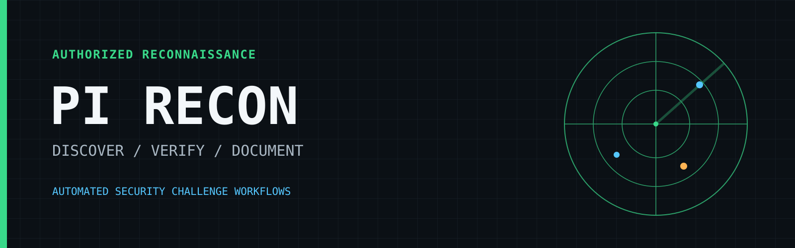
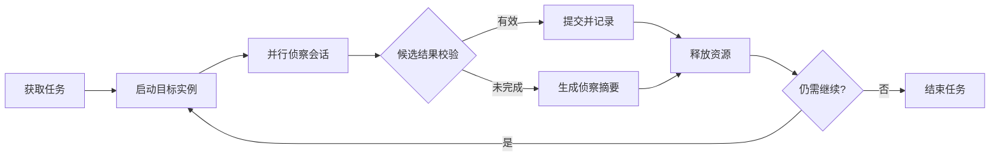

<p align="center">
  
</p>

<h1 align="center">PI Recon</h1>

<p align="center">
  面向授权安全挑战环境的自动化侦察与结果验证工具。
</p>

<p align="center">
  
  
  
</p>

PI Recon 把安全挑战中的任务获取、实例调度、代理侦察、候选结果验证和分析沉淀串成一个可持续运行的闭环。它适合需要同时处理多个目标、控制单题时间，并保留可复用调查记录的授权环境。

## 为什么使用 PI Recon

| 能力 | 作用 |
|------|------|
| 持续填槽调度 | 自动补充空闲并发槽，避免队列尾部任务长期得不到执行 |
| 有界执行 | 为每个任务设置硬超时，并在结束后释放平台资源 |
| 多阶段侦察 | 在同一任务内续接上下文，减少重复探测 |
| 结果闸门 | 对候选结果进行格式校验、去重和连续错误熔断 |
| 结构化摘要 | 记录技术栈、攻击面、已试路径、近失点和后续建议 |
| 安全构建 | 日志、会话和密钥不进入 Git，也不会被写入 Docker 镜像 |

## 工作流程



## 快速开始

要求 Python 3.10+，并确保 `pi` 命令在 `PATH` 中可用。

```bash
git clone https://github.com/weidutech/pi-recon.git
cd pi-recon

cp .env.example .env
# 在 .env 中填写 BENCHMARK_BASE_URL、BENCHMARK_TOKEN 和 PI_RECON_LLM_KEY

set -a
source .env
set +a

python3 harvest.py --only a-05  # 运行单个任务
python3 harvest.py              # 运行完整任务队列
```

## 项目结构

```text
harvest.py                 主调度器
platform_io.py             挑战平台 API 适配
agent_exec.py              侦察会话执行与事件记录
loot_gate.py               候选结果校验与提交控制
net_llm.py                 LLM 路由与连通性检测
prompts/                   侦察提示词与方法规范
docker/                    容器构建与启动配置
scripts/watch_run_logs.py  运行状态查看工具
```

运行产生的 `jobs/`、`logs/`、`work/` 和 `dist/` 均为本地数据，不会提交到 Git，也不会复制进 Docker 镜像。

## Docker

构建过程不会接收或保存 API key。密钥仅在容器启动时通过环境变量注入。

```bash
MODE=tsec ./docker/build-baidu.sh
docker run --rm --env-file .env pi-recon:tsec
```

使用 `MODE=baidu` 可构建采用 Baidu AWD 网关配置的镜像。

## 配置

| 变量 | 默认值 | 说明 |
|------|--------|------|
| `BENCHMARK_BASE_URL` | 无 | 挑战平台 API 地址 |
| `BENCHMARK_TOKEN` | 无 | 挑战平台访问令牌 |
| `PI_RECON_LLM_KEY` | 无 | LLM API key |
| `PI_RECON_LLM_BASE` | `https://api.deepseek.com/v1` | OpenAI 兼容 API 地址 |
| `PI_RECON_LLM_PROVIDER` | `deepseek` | Provider 名称 |
| `PI_RECON_LLM_MODEL` | `deepseek-v4-flash` | 模型名称 |
| `PI_RECON_CONCURRENCY` | `3` | 并行任务数 |
| `PI_RECON_JOB_TIMEOUT_SEC` | `1200` | 单任务超时秒数 |
| `PI_RECON_SEGMENTS` | `2` | 每个任务的会话阶段数 |
| `PI_RECON_JOBS_DIR` | `jobs` | 本地运行数据目录 |
| `PI_RECON_HINT_AFTER_FAIL` | `1` | 阶段失败后是否获取平台提示 |
| `PI_RECON_SECOND_WAVE` | `1` | 是否重试首轮未完成任务 |
| `PI_RECON_SUBMIT_MAX_WRONG` | `3` | 连续错误提交熔断阈值 |

提示接口可能影响挑战得分；不需要时请设置 `PI_RECON_HINT_AFTER_FAIL=0`。

## 安全边界

PI Recon 只应用于你拥有明确授权的目标。不要用它扫描无关网络、执行拒绝服务攻击或访问未授权系统。

- 不要提交 `.env`、日志、会话、结果归档或私钥文件。
- 构建镜像时不要传入密钥；在运行时使用 `--env-file` 或密钥管理服务。
- 若密钥曾进入公开仓库、构建日志或已分发镜像，应立即撤销并重新签发。
